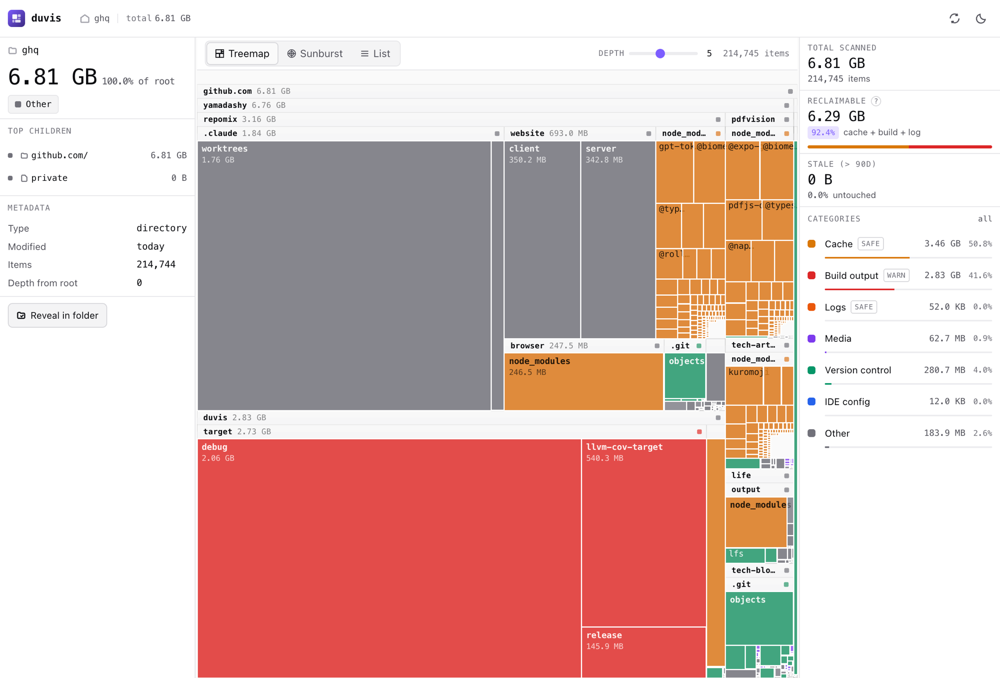
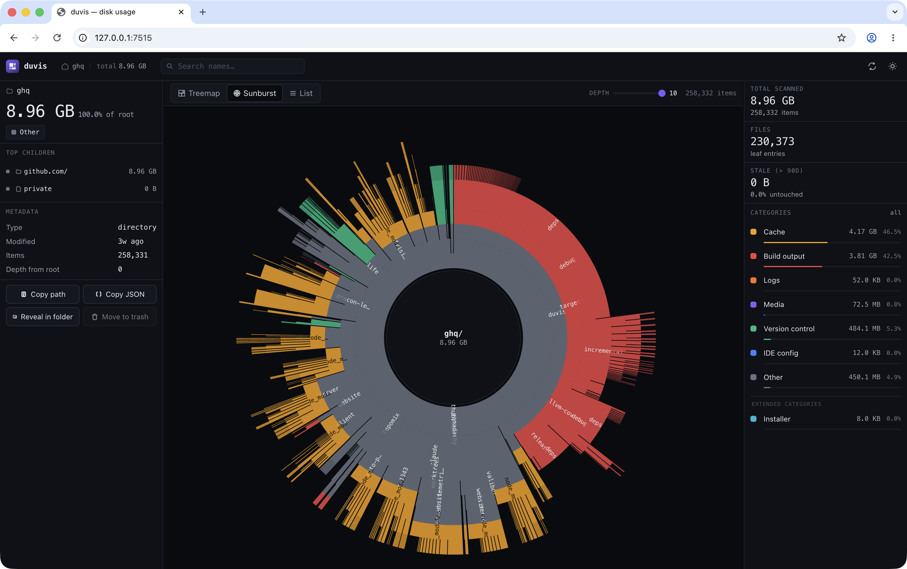

<div align="center">
  
  <h1>Duvis 📊</h1>
  <p align="center">
    <span><b>D</b>isk <b>U</b>sage <b>Vis</b>ualizer for both AI and humans</span>
  </p>
</div>

<hr />

<p align="center">
  <a href="https://crates.io/crates/duvis"></a>
  <a href="https://crates.io/crates/duvis"></a>
  <a href="https://github.com/yamadashy/duvis/actions/workflows/ci.yml"></a>
  <a href="https://codecov.io/gh/yamadashy/duvis"></a>
  <a href="https://docs.rs/duvis"></a>
  <a href="./LICENSE"></a>
</p>

- 🤖 **AI-friendly** — hierarchical JSON with size, category, and freshness
- 🖥️ **Human-friendly** — browser UI with treemap, sunburst, and list views
- ⚡ **Fast** — parallel directory scanning powered by [rayon](https://github.com/rayon-rs/rayon)
- 🛡️ **Read-only by design** — never deletes, never recommends deletions
- 🌐 **Cross-platform** — macOS, Linux, Windows

`duvis` (pronounced `/ˈduːvɪs/`, like "doo-vis") is a fast, read-only disk usage analyzer that helps both AI agents and humans understand what's filling their disk. Point it at any directory and it gives you two ways to look at it:

- **A CLI** that emits a structured JSON tree, a category summary, or a colorized terminal tree — easy to pipe into agents, scripts, or `jq`.
- **A browser UI** (React + d3) with treemap, sunburst, and list views, color-coded by category, so you can drill in visually.

Every entry is auto-tagged by category — `cache`, `build`, `log`, `vcs`, `media`, `ide` — so *"what's eating my disk?"* shows up at a glance. duvis only **shows** you the picture; deleting is your call to make with your own tools.

<p align="center">
  
</p>
<p align="center">
  
</p>

## 🚀 Quick Start

```sh
cargo install duvis
```

Or build from source:

```sh
git clone https://github.com/yamadashy/duvis.git
cd duvis
cargo install --path .
```

## 📖 Usage

```sh
# Tree view of the current directory
duvis

# Limit depth and show top N entries
duvis ~/projects --max-depth 2 --top 10

# Category-aware summary (cache / build / log / media / vcs / ide / other)
duvis ~/projects --summary

# Structured JSON output (for AI agents and scripts)
duvis ~/projects --json

# Streaming NDJSON (one record per line, jq / DB / agent friendly)
duvis ~/projects --ndjson | jq -c 'select(.type == "entry" and .size > 1000000)'

# Largest 10 entries (files + dirs) anywhere under the scan root
duvis ~/projects --largest 10

# Largest as JSON / NDJSON for agents
duvis ~/projects --json --largest 10
duvis ~/projects --ndjson --largest 10 | jq -c '. | select(.type == "entry")'

# Open browser UI with an interactive treemap
duvis ~/projects --ui
```

### Options

| Flag | Description |
| --- | --- |
| `-d, --max-depth <N>` | Maximum depth to display |
| `-n, --top <N>` | Show only the top N entries by size |
| `--json` | Output as a single JSON document with `meta` + `tree` |
| `--ndjson` | Stream entries as newline-delimited JSON (one record per line) |
| `--largest <N>` | Flat list of the N largest entries (files + dirs) ordered by size. Combines with `--json` / `--ndjson`. |
| `--summary` | Show a per-category size summary |
| `--ui` | Open browser UI with treemap visualization |
| `--port <PORT>` | Port for UI server (default: `7515`, [see below](#why-port-7515)). Falls back to a free port if busy. |
| `--sort <size\|name>` | Sort order (default: `size`) |
| `--reverse` | Reverse sort order |
| `--hardlinks <count-once\|count-each>` | How to attribute bytes to hardlinked files (default: `count-once`, matches `du`). |
| `--explain-category <NAME>` | Diagnostic: explain how a name would be classified, without scanning. Combines with `--json`. [More](#why-is-this-cache----explain-category) |

#### Filters

All filters are AND-combined and applied at the display layer — totals (parent
directory size, scan counts in `meta`) always reflect the full scanned tree;
only what's *shown* is filtered.

| Flag | Description |
| --- | --- |
| `--category <CAT>` | Restrict to one or more categories. Repeatable / CSV: `--category cache,build`. |
| `--type <file\|dir>` | Restrict by entry type. |
| `--min-size <SIZE>` | Show only entries at least this size. 1024-based: `100M`, `1.5G`, `50KiB`, `1024` (bare = bytes). |
| `--name <GLOB>` | Restrict to **basenames** matching one or more globs. Repeatable; multiple are OR-combined: `--name "*.log" --name "*.tmp"`. |
| `--changed-within <DURATION>` | Modified within the past `Nd` / `Nw` / `Nm` / `Ny` (m=30d, y=365d). |
| `--changed-before <DURATION>` | Modified more than `<DURATION>` ago. Combine with `--changed-within` for a window. |

`--json` / `--ndjson` / `--summary` / `--ui` are mutually exclusive; pass at most one. With none, the default tree view is shown. `--largest <N>` is a separate view (mutually exclusive with `--summary` / `--ui`) that pairs orthogonally with `--json` / `--ndjson` for structured output. Filters compose with every view.

### Output examples

#### Tree

```
project (438.9 MB)
├── target/  [build] 438.8 MB
├── .git/    [vcs]    54.7 KB
├── src/              24.5 KB
└── Cargo.toml        418 B
```

#### Summary

```
Total: 438.9 MB

Category Summary:
  build      438.9 MB  100%  1 items
```

#### Largest

```
$ duvis ~/projects --largest 5
Largest 5 entries in /Users/me/projects (of 1234 total):

  438.8 MB  target/                 [build]   dir
   54.7 KB  .git/                   [vcs]     dir
   24.5 KB  src/                    [other]   dir
    8.2 KB  src/main.rs             [other]   file
      418 B Cargo.toml              [other]   file
```

With `--json --largest`, the response is `{meta, largest: [...]}` (no `tree` field
— this is a flat list, not a hierarchical view). `meta.largest_requested` and
`meta.total_entries` let an agent tell whether the list it sees was truncated.

#### JSON

```json
{
  "meta": {
    "wire_version": 2,
    "duvis_version": "0.1.4",
    "scan_root": "/Users/me/project",
    "hardlinks": "count-once",
    "items_scanned": 1234,
    "items_skipped": 0
  },
  "tree": {
    "name": "project",
    "relative_path": ".",
    "depth": 0,
    "size": 460195536,
    "size_human": "438.9 MB",
    "is_dir": true,
    "category": "build",
    "modified_days_ago": 0,
    "file_count": 412,
    "dir_count": 38,
    "children": [
      { "name": "target", "relative_path": "target", "size": 460091645, "category": "build", ... }
    ]
  }
}
```

When `--top N` drops some children, the parent gets `truncated_count` and `truncated_size`
fields so consumers can tell how much was hidden. `file_count` / `dir_count` always reflect
the *full* scanned subtree — they don't change with `--top` or `--max-depth`.

#### NDJSON

```jsonl
{"type":"meta","wire_version":2,"duvis_version":"0.1.4","scan_root":"/Users/me/project",...}
{"type":"entry","name":"project","relative_path":".","depth":0,"size":460195536,...}
{"type":"entry","name":"target","relative_path":"target","depth":1,"size":460091645,...}
```

One JSON object per line, in DFS pre-order (parent before its children). Designed for
streaming pipelines: `duvis ~/projects --ndjson | jq -c 'select(.size > 1e8)'`.

## 🧠 Concepts

### Categories

`duvis` classifies entries into a small **core** vocabulary that always
appears in the legend, plus a handful of **extended** categories that show
up only when something matches them. Core stays compact for typical
project trees; extended pops into view when relevant (e.g. a `model_cache`
row appears on an AI dev machine, an `installer` row appears in
`~/Downloads`).

#### Core

- `cache` — package and tool caches (`node_modules/`, `.cache/`, `__pycache__/`, `.cargo/`, ...)
- `build` — build artifacts (`target/`, `dist/`, `build/`, `.next/`, ...)
- `log` — log files (`*.log`, `logs/`, ...)
- `media` — images, video, audio
- `vcs` — version control metadata (`.git/`, ...)
- `ide` — IDE/editor metadata (`.idea/`, `.vscode/`, ...)
- `other` — everything else

#### Extended (shown only when present)

- `archive` — compressed bundles (`*.zip`, `*.tar.gz`, `*.7z`, `*.zst`, ...)
- `installer` — install packages (`*.dmg`, `*.pkg`, `*.exe`, `*.deb`, `*.AppImage`, ...)
- `vm_image` — virtual machine disk images (`*.vdi`, `*.vmdk`, `*.qcow2`, OrbStack's `data.img.raw`, ...)
- `model_cache` — local AI model stores (`.ollama/`, `.lmstudio/`, `.huggingface/`)
- `backup` — backups (Time Machine, `*.bak`, `*.backup`, `*.old`)

Categories are assigned by directory or file name. Once a directory is classified
as anything other than `other`, **everything inside it inherits that category** —
because that directory is the natural grouping unit (a `node_modules` is a
single thing, not a heap of unrelated files). The outermost named ancestor
wins, so a project root that happens to contain a giant `node_modules` is
*not* itself classified as `cache`.

#### Why is this `cache`? — `--explain-category`

When you see a category in a scan and want to know *which* rule fired, run:

```
$ duvis --explain-category node_modules
"node_modules"
  as directory: cache        (matched directory rule: node_modules)
  as file:      other        (no rule matched; defaulted to other)

$ duvis --explain-category data.img.raw
"data.img.raw"
  as directory: other        (no rule matched; defaulted to other)
  as file:      vm_image     (matched filename suffix: data.img.raw)
```

The same name can match different rules in each role (directory vs file), so
both interpretations are always shown. Pass `--json` for structured output —
useful when an agent wants to consume the rule that fired, not just the
category. `--explain-category` skips scanning entirely; the `PATH` argument
is ignored when this flag is given.

### How sizes are measured

On Unix, `duvis` reports the bytes a file actually occupies on disk
(`st_blocks × 512`, the same default as `du`). Sparse files like VM images —
for example OrbStack's `data.img.raw` — show their real footprint, not the
multi-terabyte logical size you'd get from `ls -l`.

Hardlinked files are counted once per inode by default, also matching `du` —
a 1 GB file with two hardlinks contributes 1 GB to the total, not 2 GB. The
first path to reach the inode reports the bytes; later links report 0.
Pass `--hardlinks count-each` to opt out and have every link contribute
its full size (matching tools that don't dedupe by inode).

Windows falls back to apparent size for now and does not dedupe hardlinks.

## ❓ FAQ

### Why port 7515?

In the spirit of [Vite's `5173`](https://vite.dev/) (`SITE`/`VITE` written
with Roman numerals + leet — `V`=5, `I`=1, `T`=7, `E`=3), `duvis` defaults to
**`7515`**: drop `D` (it's basically a closed `O`), tilt `U` on its side and
it's a `7`, `V`=5 (Roman), `I`=1, `S`=5 (leet). Not assigned to anything in
the IANA registry, far enough from the `8080`/`3000`/`5173` clash zones,
and if it's still busy on your machine `duvis` quietly falls back to a free
OS-assigned port.

## 📜 License

[MIT](./LICENSE) © Kazuki Yamada
